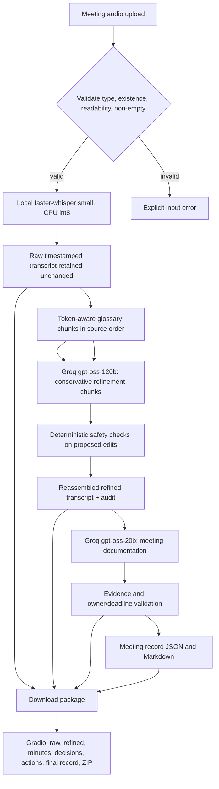

# Architecture

## Information movement

The raw transcript is stored independently and is passed to the refinement stage alongside extracted glossary terms. The documentation model sees the refined transcript, not the audio. Python validates edit safety and evidence after model responses. The final ZIP includes the unchanged raw transcript, refined text, structured decisions/action items, minutes, complete record, audit, and source audio.
